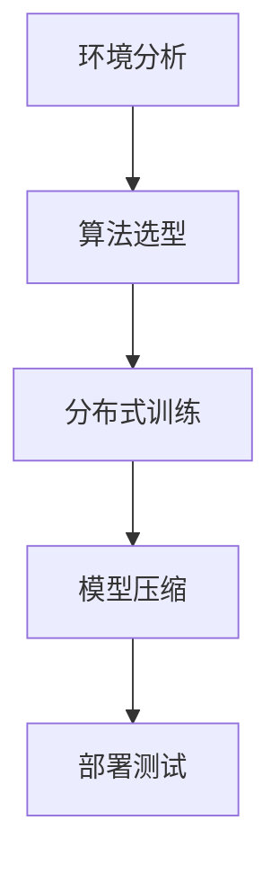

<!-- p10k configurep10k configure -->### intro
从今天起，我决定从零开始，一步步地通过实践动手学习强化学习。
我希望有以下收获：
- 了解什么是强化学习
- 掌握强化学习的基本技术
- 掌握强化学习的基本算法
- 获得阅读state-of-art的强化学习paper的能力
- 能够运用强化学习解决现有问题
- 可以独立地提出/改进强化学习算法

### background

我是计算机科班出身，有比较良好的代码（c，c++，python，rust）基础以及计算机基础知识（git，ssh等），英文阅读能力，数理基础。
目前在一台和小组公用的8卡A800服务器上工作，所以我希望有比较合适的环境搭建方案。
### method
让deepseek教我，再另外找一个老师检查我的学习成果。由于我的时间比较紧，我希望在一周之内掌握intro部分的内容。请你帮我列一个学习大纲。

---

### **Day 1：强化学习基础构建**
**目标**：建立理论框架 + 环境配置
1. **核心概念速成**（2小时）
   - Markov决策过程（MDP）核心四要素：状态空间/动作空间/转移概率/奖励函数
   - Value Function与Bellman方程推导（重点理解动态规划思想）
   - Q-Learning与Policy Gradient的直观对比（表格法 vs 函数逼近）

2. **环境配置**（1小时）
   - 使用Docker创建隔离环境（推荐nvidia-docker + PyTorch镜像）
   ```dockerfile
   FROM nvcr.io/nvidia/pytorch:23.10-py3
   RUN pip install gym[all] stable-baselines3 tensorboard
   ```
   - 配置SSH端口转发用于TensorBoard可视化

3. **第一个RL程序**（3小时）
   ```python
   import gym
   env = gym.make("CartPole-v1", render_mode="human")
   observation, info = env.reset()
   for _ in range(1000):
       action = env.action_space.sample()  # 随机策略
       observation, reward, terminated, _, info = env.step(action)
       if terminated: break
   env.close()
   ```

---

### **Day 2：经典算法实现**
**目标**：手写核心算法 + 性能分析
1. **Q-Learning实战**（3小时）
   - 实现离散状态空间版本
   - 加入ε-greedy探索策略
   ```python
   class QLearning:
       def __init__(self, state_dim, action_dim, lr=0.1, gamma=0.99):
           self.q_table = np.zeros((state_dim, action_dim))
           self.lr = lr
           self.gamma = gamma

       def update(self, s, a, r, s_next):
           td_target = r + self.gamma * np.max(self.q_table[s_next])
           self.q_table[s,a] += self.lr * (td_target - self.q_table[s,a])
   ```

2. **策略梯度实现**（4小时）
   - 基于PyTorch的神经网络策略
   - REINFORCE算法实现
   ```python
   class PolicyNet(nn.Module):
       def __init__(self, state_dim, hidden_dim, action_dim):
           super().__init__()
           self.fc1 = nn.Linear(state_dim, hidden_dim)
           self.fc2 = nn.Linear(hidden_dim, action_dim)

       def forward(self, x):
           x = F.relu(self.fc1(x))
           return F.softmax(self.fc2(x), dim=1)
   ```

---

### **Day 3：深度强化学习突破**
**目标**：掌握DRL核心算法
1. **DQN及其变种**（4小时）
   - Experience Replay实现技巧
   - Double DQN与Dueling DQN对比
   ```python
   class ReplayBuffer:
       def __init__(self, capacity):
           self.buffer = collections.deque(maxlen=capacity)

       def add(self, state, action, reward, next_state, done):
           self.buffer.append((state, action, reward, next_state, done))
   ```

2. **Actor-Critic框架**（3小时）
   - 实现A2C算法
   - 理解优势函数估计

---

### **Day 4：并行化训练实战**
**目标**：多GPU分布式训练
1. **PPO算法实现**（5小时）
   ```python
   # 使用PyTorch DistributedDataParallel
   model = PPO().to(device)
   model = DDP(model, device_ids=[local_rank])
   ```

2. **多环境交互优化**（2小时）
   - 使用SubprocVecEnv实现并行环境

---

### **Day 5：前沿论文精读**
**目标**：掌握论文解析方法
1. **经典论文精读**：
   - [DQN] Human-level control through deep reinforcement learning (Nature 2015)
   - [PPO] Proximal Policy Optimization Algorithms (arXiv 2017)

2. **论文复现技巧**：
   - 使用W&B进行实验跟踪
   - Gradient checkpointing节省显存

---

### **Day 6-7：综合项目实战**
**目标**：完整项目开发
**项目选题建议**：
1. 基于MuJoCo的机器人控制
2. 星际争霸II mini-game智能体开发

**开发流程**：


**性能优化技巧**：
- 使用NVIDIA DALI加速数据预处理
- 混合精度训练配置
```python
scaler = GradScaler()
with autocast():
    loss = compute_loss()
scaler.scale(loss).backward()
scaler.step(optimizer)
```

---

### **学习资源清单**
1. **实践工具链**：
   - RL Baselines3 Zoo
   - NVIDIA Isaac Gym

2. **进阶资料**：
   - 《深度强化学习实践》
   - OpenAI Spinning Up

3. **论文管理**：
   - 使用Zotero管理文献
   - Papers With Code跟踪最新进展

---

### **注意事项**
1. GPU资源管理：
```bash
# 使用GPU绑定技术
CUDA_VISIBLE_DEVICES=0,1 python train.py
```

2. 实验版本控制：
```bash
dvc init
dvc add models/
```

这个计划将理论与实践的比例控制在3:7，重点突破工程实现能力。建议每天保持6-8小时高强度学习，过程中遇到具体实现问题可以随时深入讨论。需要调整难度或补充某个方向的细节请随时告知。